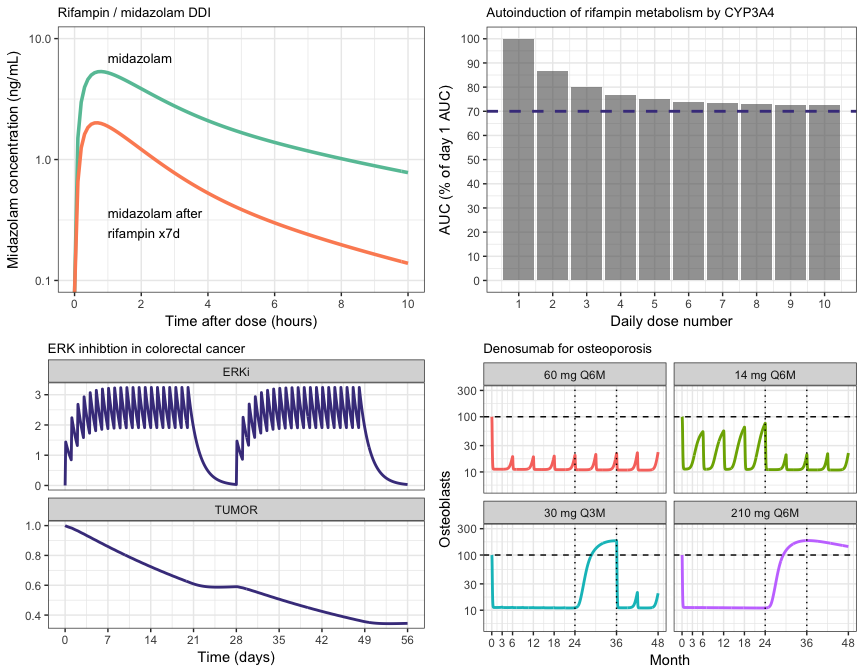

Case studies with mrgsolve: PBPK and QSP model implementation and utilization in R
================

Location
========

-   University of Florida - College of Pharmacy (Orlando Lake Nona Campus)
-   Saturday, 24 March 1:30 pm to 5:30 pm

Reading List
============

-   **Quantitative Analyses of Hepatic OATP-Mediated Interactions Between Statins and Inhibitors Using PBPK Modeling With a Parameter Optimization Method**
    -   Yoshikado T, Yoshida K, Kotani N, Nakada T, Asaumi R, Toshimoto K, Maeda K, Kusuhara H, Sugiyama Y. Clin Pharmacol Ther. 2016 Nov;100(5):513-523. PMID: 27170342
    -   <https://www.ncbi.nlm.nih.gov/pubmed/27170342>
-   **Comprehensive PBPK Model of Rifampicin for Quantitative Prediction of Complex Drug-Drug Interactions: CYP3A/2C9 Induction and OATP Inhibition Effects**
    -   Asaumi R, Toshimoto K, Tobe Y, Hashizume K, Nunoya KI, Imawaka H, Lee W, Sugiyama Y. CPT Pharmacometrics Syst Pharmacol. 2018 Jan 25. PMID: 29368402
    -   <https://www.ncbi.nlm.nih.gov/pubmed/29368402>
-   **Clinical responses to ERK inhibition in BRAF(V600E)-mutant colorectal cancer predicted using a computational model**
    -   Kirouac DC, Schaefer G, Chan J, Merchant M, Orr C, Huang SA, Moffat J, Liu L, Gadkar K, Ramanujan S. NPJ Syst Biol Appl. 2017 Jun 2;3:14. PubMed PMID: 28649441
    -   <https://www.ncbi.nlm.nih.gov/pubmed/28649441>
-   **Predicting nonlinear changes in bone mineral density over time using a multiscale systems pharmacology model**
    -   Peterson MC, Riggs MM. CPT Pharmacometrics Syst Pharmacol. 2012 Nov 14;1:e14. PMID: 23835796
    -   <https://www.ncbi.nlm.nih.gov/pubmed/23835796>
