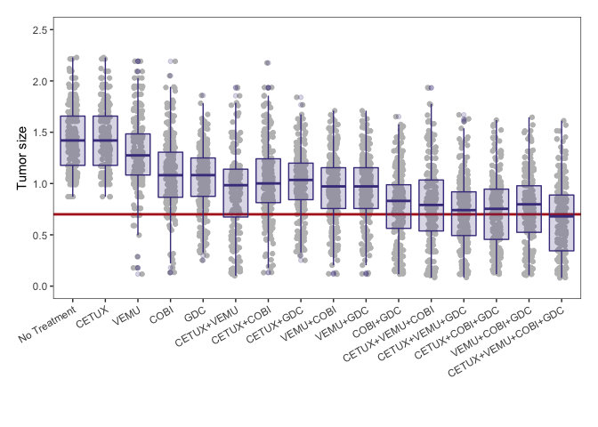

Clinical responses to ERK inhibition in BRAF{V600E}-mutant colorectal cancer
================
Metrum Research Group, LLC

-   [Translation](#translation)
-   [Demo](#demo)
    -   [Generate dosing regimens](#generate-dosing-regimens)

``` r
library(mrgsolve)
library(tidyverse)
source("functions.R")
```

**Clinical responses to ERK inhibition in BRAF{V600E}-mutant colorectal cancer predicted using a computational model**

-   Daniel C. Kirouac, Gabriele Schaefer, Jocelyn Chan, Mark Merchant, Christine Orr, Shih-Min A. Huang, John Moffat, Lichuan Liu, Kapil Gadkar and Saroja Ramanujan

-   npj Systems Biology and Applications (2017) 3:14 ; <doi:10.1038> / s41540-017-0016-1

Translation
===========

-   Model published as SBML
-   Translator from previous project work using R bindings to libSBML
-   Minor modifications to the translator code to accommodate the MAPK model as published

Demo
====

-   Re-create figure 6B in the publication

``` r
mod <- mread_cache("mapk", "models")
```

Read in the virtual population

``` r
vp <- readRDS("data/s10vpop_pk.RDS")

dim(vp)
```

    . [1] 250 147

Update the model object with one set of parameters

``` r
mod <- param(mod, slice(vp, 1))
```

Generate dosing regimens
------------------------

-   **No treatment**

``` r
data0 <- ev(amt=0, cmt=8)
```

-   **BRAF inhibitor** - vemurafanib (VEMU)
-   Compartment 8

``` r
dataV <- ev(amt=960,  cmt=8, ii=0.5, addl=120)
```

-   **ERK inhibitor** - GCD-994 (GDC)
-   Compartment 12

``` r
dataG <- ev(amt = 400, cmt = 12, ii = 1, addl = 20)

dataG <- seq(dataG, wait = 7, dataG) 

out <- mrgsim(mod, ev=dataG, end=56)

plot(out, ERKi_C~time)
```


-   **MEK inhibitor** - cobimetinib (COBI)
-   Compartment 10

``` r
dataCO <- mutate(dataG,amt=60,cmt=10)
```

-   **EGFR inihbitor** - cetuximab (CETUX)
-   Compartment 7

``` r
dataCE <- ev(cmt=7,ii=7,addl=7,amt=450)
```

We create two functions: one to combine dosing regimens and the other to simulate from a dosing regimen

``` r
comb <- function(...) {
  x <- lapply(list(...), as.data.frame)
  bind_rows(x) %>% arrange(time)
}

sim <- function(Data,Vp,Mod) {
  Mod %>%
    ev(as.ev(Data)) %>%
    mrgsim(idata=Vp,end=-1, add = 56) %>%
    filter(time==56) 
}
```

For example

``` r
comb(dataCE,dataV)
```

    .   time cmt  ii addl amt evid
    . 1    0   7 7.0    7 450    1
    . 2    0   8 0.5  120 960    1

``` r
sim(comb(dataCE,dataV), Vp = slice(vp,seq(10)), Mod = mod)
```

    . # A tibble: 10 x 23
    .       ID  time   TD1 CELLS      FB1      FB2      FB3   FB4 RTK1i_blood
    .    <dbl> <dbl> <dbl> <dbl>    <dbl>    <dbl>    <dbl> <dbl>       <dbl>
    .  1    1.   56. 0.996 0.871 0.695    0.695    0.695    0.437        246.
    .  2    2.   56. 0.401 0.963 0.000144 0.000144 0.000144 0.547        246.
    .  3    3.   56. 0.363 1.18  0.000115 0.000115 0.000115 0.703        246.
    .  4    4.   56. 0.186 0.726 0.000152 0.000152 0.000151 0.649        246.
    .  5    5.   56. 0.348 0.903 0.0221   0.0220   0.0220   0.662        246.
    .  6    6.   56. 0.999 1.06  0.939    0.939    0.939    0.731        246.
    .  7    7.   56. 0.999 1.42  0.902    0.902    0.902    0.731        246.
    .  8    8.   56. 0.636 1.02  0.000239 0.000230 0.000227 0.630        246.
    .  9    9.   56. 0.952 1.16  0.195    0.195    0.195    0.688        246.
    . 10   10.   56. 0.964 1.02  0.252    0.252    0.252    0.649        246.
    . # ... with 14 more variables: RAFi_gut <dbl>, RAFi_blood <dbl>,
    . #   MEKi_gut <dbl>, MEKi_blood <dbl>, ERKi_gut <dbl>, ERKi_blood <dbl>,
    . #   AKTi_gut <dbl>, AKTi_blood <dbl>, MEKi_V3 <dbl>, RTK1i_gut <dbl>,
    . #   ERKi <dbl>, ERKi_C <dbl>, TUMOR <dbl>, GDC <dbl>

Generate a data frame of runs to do

``` r
sims <- 
  tribble(
    ~label, ~object, 
    "No Treatment",        data0,
    "CETUX",               dataCE, 
    "VEMU",                dataV,
    "COBI",                dataCO, 
    "GDC",                 dataG,
    "CETUX+VEMU",          comb(dataCE, dataV), 
    "CETUX+COBI",          comb(dataCE, dataCO), 
    "CETUX+GDC",           comb(dataCE, dataG),
    "VEMU+COBI",           comb(dataV, dataG), 
    "VEMU+GDC",            comb(dataV, dataG),
    "COBI+GDC",            comb(dataCO, dataG),
    "CETUX+VEMU+COBI",     comb(dataCE, dataV,dataCO), 
    "CETUX+VEMU+GDC",      comb(dataCE, dataV,dataG), 
    "CETUX+COBI+GDC",      comb(dataCE, dataCO,dataG), 
    "VEMU+COBI+GDC",       comb(dataV, dataCO,dataG),
    "CETUX+VEMU+COBI+GDC", comb(dataCE, dataV, dataCO, dataG)
  ) %>% mutate(object = map(object,as.data.frame))
```

Run the simulation

``` r
sims <- mutate(sims, out = parallel::mclapply(object,sim, Vp = vp, Mod = mod))
```

Get ready to plot

``` r
sms <- select(sims, label, out) %>% unnest()

sms <- mutate(sms, labelf = fct_inorder(label))

head(sms)
```

    . # A tibble: 6 x 25
    .   label           ID  time   TD1 CELLS   FB1   FB2   FB3   FB4 RTK1i_blood
    .   <chr>        <dbl> <dbl> <dbl> <dbl> <dbl> <dbl> <dbl> <dbl>       <dbl>
    . 1 No Treatment    1.   56. 0.998 0.872 0.822 0.822 0.822 0.714          0.
    . 2 No Treatment    2.   56. 0.998 1.42  0.800 0.800 0.800 0.478          0.
    . 3 No Treatment    3.   56. 0.999 1.78  0.916 0.916 0.916 0.708          0.
    . 4 No Treatment    4.   56. 0.995 1.51  0.583 0.583 0.583 0.644          0.
    . 5 No Treatment    5.   56. 0.999 1.43  0.951 0.951 0.951 0.664          0.
    . 6 No Treatment    6.   56. 0.999 1.06  0.940 0.940 0.940 0.731          0.
    . # ... with 15 more variables: RAFi_gut <dbl>, RAFi_blood <dbl>,
    . #   MEKi_gut <dbl>, MEKi_blood <dbl>, ERKi_gut <dbl>, ERKi_blood <dbl>,
    . #   AKTi_gut <dbl>, AKTi_blood <dbl>, MEKi_V3 <dbl>, RTK1i_gut <dbl>,
    . #   ERKi <dbl>, ERKi_C <dbl>, TUMOR <dbl>, GDC <dbl>, labelf <fct>

``` r
p1 <- 
  ggplot(data=sms) + 
  geom_point(aes(x=labelf, y=TUMOR),position=position_jitter(width=0.15),col="grey") +
  scale_y_continuous(limits=c(0,2.5),name="Tumor size",breaks=c(0,0.5,1,1.5,2,2.5,3)) +
  scale_x_discrete(name="") + 
  geom_hline(yintercept=0.7,col="firebrick", lty=1,lwd=1)  +
  geom_boxplot(aes(x=labelf,y=TUMOR),fill="darkslateblue",col="darkslateblue",alpha=0.2) +
  theme_plain() + rotx(30)
p1
```


